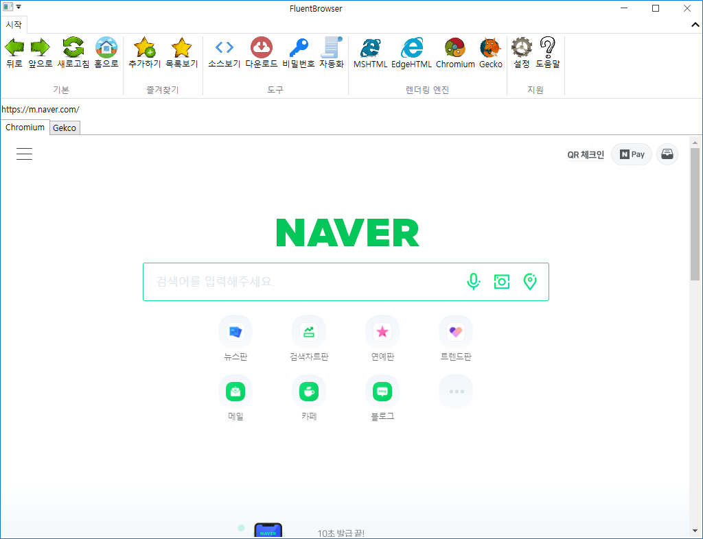

# FluentBrowser

Web browsing with multiple engine

  * MSHTML (mshtml.dll) - todo
  * EdgeHTML (edgehtml.dll) - todo
  * Chromium (ex: Google Chrome) - CefSharp
  * Gecko (ex: Firefox) - GeckoFX
  * Support automation - todo

## Screenshot

## Contact me 
  * gnh1201@gmail.com
